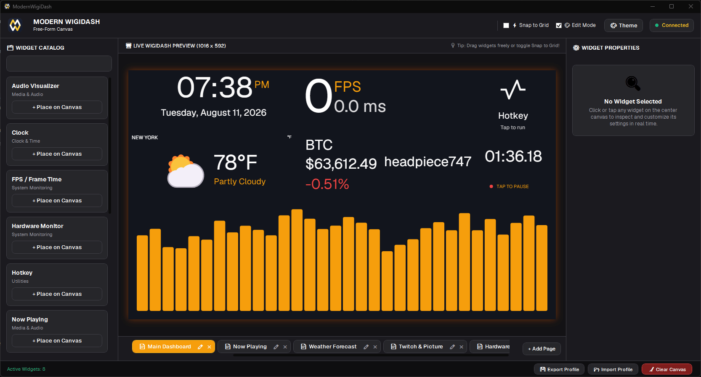

<div align="center">


# ModernWigiDash

**A modern, open-source widget stack for the G.Skill WigiDash 7″ USB touch panel.**

[](https://dotnet.microsoft.com/)
[](https://learn.microsoft.com/en-us/dotnet/csharp/)
[](ModernWigiDash.Tests)
[](https://www.microsoft.com/windows)
[](https://github.com/headpiece747/ModernWigiDash/releases/latest)
[](LICENSE)

</div>

ModernWigiDash replaces vendor dashboard software with a **zero-allocation SkiaSharp frame compositor**, an **extensible widget plugin architecture**, direct USB access, and **in-app auto-updates**, all built on .NET 10 with current C# idioms. Frames stream to the display over direct **USB HID / WinUSB** transport, with hardware telemetry (via LibreHardwareService), frame-time analytics (via PresentMon Service), Twitch chat, media controls, and market tickers at your fingertips.

<div align="center">



</div>

---

## Architecture

ModernWigiDash is a single WPF app that owns the USB display directly, no background service to install:

```
┌───────────────────────────────────────────────────────────────────────────┐
│                          ModernWigiDash.App                              │
│          (WPF Configuration UI · Layout Editor · Inspector)              │
│                                                                           │
│   ┌──────────────────┐   ┌──────────────────┐   ┌────────────────────┐   │
│   │  WidgetPlugin    │   │  SkiaFrame       │   │  Gesture           │   │
│   │  Loader          │   │  Compositor      │   │  Interpreter       │   │
│   │  (catalog)       │   │  (30 FPS ·       │   │  (swipe / edge tap)│   │
│   │                  │   │   zero-alloc)    │   │                    │   │
│   └──────────────────┘   └──────────────────┘   └────────────────────┘   │
│                                                                           │
│   LhmSharedMemoryReader ── LHS shared memory ──► LibreHardwareService     │
│   PresentMonFrameTimeProducer ── named pipe ──► PresentMon Service        │
└──────────────────────────────────┬───────────────────────────────────────┘
                                   │  Direct USB / HID Transport (WinUSB)
                                   │  frames → · touch ←
┌──────────────────────────────────▼───────────────────────────────────────┐
│                       G.Skill WigiDash 7″ Display                        │
│                    (1024×600 panel · 1016×592 framebuffer)               │
└───────────────────────────────────────────────────────────────────────────┘
```

- **Direct-USB Transport.** The App owns the device via `DisplayDeviceEngine` / `DisplayHidTransport`: frames stream over bulk writes and touch is polled at 16 ms, normalized once through the shared `TouchReport.ToEventType` site. No elevation or service installation required.
- **High-Rate SkiaSharp Rendering.** The App composites at a steady **30 FPS** via `SkiaFrameCompositor`, using a pooled `FrameBufferPool` and zero-allocation hot paths (stack-allocated Z-order sorting, span-based sparklines, array-reuse frame delivery) to keep GC pressure minimal.
- **In-App Auto-Update.** An amber update button appears in the header when a newer release exists; one click downloads the slim app-only payload (SHA-256 verified), and restarting applies it **in place**. Profile and theme are preserved.
- **Power Lifecycle.** On Windows sleep the frame pump pauses; on resume it restarts and the USB transport reconnects, so the display resumes streaming cleanly.
- **Standby on Exit.** The display returns to its vendor Welcome screen and is put to sleep (backlight off) whenever the app closes; starting the app again wakes it.

---

## Key Features

| Area | Detail |
| :--- | :--- |
| **Hardware Abstraction** | Direct USB HID control via `DisplayHidTransport`, native WinUSB P/Invoke with LibUsbDotNet fallback |
| **Hardware Telemetry** | Live CPU, GPU, VRAM, RAM, and thermal readouts read from **LibreHardwareService's** shared-memory maps (ADR-0004), no elevation required |
| **Frame-Time Analyst** | Real-time FPS and frame-time graphs driven by Intel's **PresentMon Service** (ADR-0003). The app connects non-elevated and polls a rolling 1s dynamic query for FPS, frame times, and GPU busy. The readout drops to **zero when the tracked target isn't actually displayed** (e.g. a backgrounded fullscreen game) instead of showing its hidden render rate |
| **In-App Auto-Update** | Checks GitHub once at startup; downloads a slim app-only zip (~90 MB, SHA-256 verified) and swaps the executable in place on restart, no manual zip juggling |
| **Power Lifecycle** | Windows sleep/resume handling: the 30 FPS pump pauses on suspend and restarts with a forced USB reconnect on wake |
| **Titanium Amber Theme** | Dark titanium finish with amber accents, high-contrast indicators, and rounded container cards. Persisted to `app_theme.json` in `%LocalAppData%\ModernWigiDash` (a pre-release copy next to the exe migrates automatically, one time); the profile export carries the theme and import offers a one-click restore |
| **Profile Persistence** | Auto-saved profile (`profile.json` in `%LocalAppData%\ModernWigiDash`). Widget placements, pages, and property values survive restarts via debounced save + flush-on-close; `display_device.log` and `crash.log` live in the same folder, never next to the exe |
| **Profile Import / Export** | Manual JSON profile round-trip with import sanitization: widget/page count caps, ActionCommand stripping, and path checks against malicious profiles. The export bundle carries an optional theme section; a restore offer on import is declined safely (the profile import itself never touches the theme file) |
| **Tray & Settings Hub** | Per-profile opt-in **hide to tray** on close or minimize, with a system tray icon (Show / Quit) and a single-instance guard (a second launch activates the first window). The **⚙️ Settings hub** groups Appearance (theme colors, page background), Behavior (close behavior, start with Windows, hotkey kill switch), and Profile (export / import) |
| **Start with Windows** | Per-user autostart (HKCU, no elevation) with a Settings checkbox; the autostarted instance opens minimized and keeps streaming frames to the display |
| **Minimize to Tray on Startup** | Machine-local opt-in (Behavior group): the next launch opens hidden to the tray instead of showing the window, while the display keeps streaming. Composes with Start with Windows (the `--startup` + flag combination hides rather than minimizes) |
| **Global Hotkeys** | The Hotkey widget binds an OS-level chord (Ctrl/Alt/Shift/Win + key) that fires even while the app is hidden to the tray, including a **Flip page** action and a **Run AHK Script** action that spawns your own AutoHotkey script. A machine-local **kill switch** in Settings vetoes the global registration and the AHK spawn (the anti-cheat off-switch) |
| **Typography & Icons** | Dynamic font fallback engine with embedded Geist variable fonts and generated vector icon paths (`GriddyIcons`) |
| **Extensible Plugin SDK** | Build isolated C# widget assemblies targeting `ModernWigiDash.Sdk` |

---

## Included Widget Suite

| Widget | Description |
| :--- | :--- |
| **Hardware Monitor** | Multi-gauge readouts for CPU, GPU, VRAM, memory, and storage utilization (via LibreHardwareService) |
| **FPS / Frame Time** | Real-time FPS, 1% / 0.1% lows, and GPU-busy metrics with an overlay-style readout (via PresentMon Service); reads zero when the tracked app isn't on screen |
| **Audio Visualizer** | Real-time multi-band spectrum and oscilloscope visualization from WASAPI loopback capture |
| **Now Playing** | Windows System Media Transport Controls integration with album artwork and transport buttons |
| **Twitch** | Real-time channel chat viewer and live-channel status with Device-Authorization login |
| **Hotkey** | Customizable macro buttons with vector icon support, global hotkey chords (tray-aware), and user AutoHotkey script actions |
| **Stock & Crypto** | Real-time crypto, stock, and FX price feeds (Binance, Finnhub, Yahoo, CoinGecko) |
| **Clock** | Analog and digital clocks (optional seconds display) |
| **Stopwatch & Timer** | Stopwatch and countdown timer |
| **Picture & GIF Viewer** | Static image and animated GIF playback |
| **Weather Forecast** | Multi-day weather conditions with live refresh (optional hide-location) |
| **Text** | Static or animated text banners |

---

## Solution Layout

| Project | Description |
| :--- | :--- |
| `ModernWigiDash.App` | WPF layout editor, theme customizer, inspector, frame compositing host, and direct-USB engine owner |
| `ModernWigiDash.Hardware` | Low-level USB HID transport, RGB565 frame encoder, WinUSB P/Invoke, touch report normalization, device engine |
| `ModernWigiDash.Core` | Page-layout domain models, profile ops (page/widget CRUD, sanitized import/export), font catalog, SkiaSharp compositor, plugin loader |
| `ModernWigiDash.Sdk` | Widget contracts (`IModernWidget`, `IModernWigiDashContext`), attributes, frame delivery/pooling, poll-loop primitives, telemetry DTOs |
| `ModernWigiDash.Widgets` | Built-in widget implementations (telemetry, Twitch, media, tickers, system controls) |
| `ModernWigiDash.Tests` | MSTest suite covering protocols, encoding, stores, frame delivery, profile sanitization, and widget lifecycle |

---

## Requirements

- **OS**: Windows 10 or Windows 11 (x64)
- **Runtime**: none for release builds (self-contained single-file EXE); the .NET 10 SDK is required only to build from source
- **Hardware**: [G.Skill WigiDash](https://www.gskill.com/product/412/415/1702982997/WigiDash) 7″ USB touch panel (`USB\VID_28DA&PID_EF01`)
- **Optional**: [LibreHardwareService](https://github.com/epinter/LibreHardwareService) (hardware sensors) and [PresentMon Service](https://github.com/microsoft/PresentMon) (frame-time analytics). The app runs without them; the related widgets show an unavailable state

---

## Quick Start

### Option A: Download a Release (no .NET install)

Grab the latest `ModernWigiDash-vX.Y.Z-win-x64.zip` from the [Releases page](https://github.com/headpiece747/ModernWigiDash/releases/latest). It contains a single, self-contained, ReadyToRun executable. Unzip it next to the `Resources` folder and run `ModernWigiDash.App.exe`. No .NET runtime or SDK is required.

> **First launch:** the release executable is unsigned (open source, no code-signing certificate), so Windows SmartScreen may show *"Windows protected your PC"* once per machine. Click **More info → Run anyway**.

**Updating:** the app checks for new releases at startup. When one is available, an amber button appears in the header. Click it to download, then restart to apply in place. Your profile and theme are preserved. (Dev builds and older release versions without the updater use the manual zip flow.)

### Option B: Build from Source

```powershell
git clone https://github.com/headpiece747/ModernWigiDash.git
cd ModernWigiDash

dotnet build ModernWigiDash.slnx -c Release
dotnet test ModernWigiDash.slnx -c Release
dotnet run --project ModernWigiDash.App\ModernWigiDash.App.csproj
```

The app connects to the display directly over USB. Frames and touch work with no service installation. Hardware telemetry requires LibreHardwareService to be installed; frame-time widgets require PresentMon Service; both degrade gracefully to an "unavailable" state when absent.

---

## Packaging a Release

Release zips are built and published **automatically by CI**: push a `v*` tag (e.g. `v0.6.0`) and the **Release** workflow runs `scripts/build-release.ps1 -Version 0.6.0`, then creates a GitHub Release with the two versioned assets attached. You can also trigger it manually from the **Actions** tab with a tag input.

Each release ships two zips:

- **`ModernWigiDash-vX.Y.Z-win-x64.zip`.** The full bundle: the single-file exe + `Resources` + bundled LibreHardwareService and PresentMon installers (used by `setup-telemetry.bat`). Use this for fresh installs.
- **`ModernWigiDash-vX.Y.Z-app-only.zip`.** The slim exe + `Resources` only (~90 MB). This is the **in-app updater's payload, never use it for a fresh install** (it has no telemetry installers).

The build stamps the exe with the release version (`InformationalVersion` for the updater, `FileVersion` for Explorer's Details tab), auto-resolves the latest upstream telemetry versions (recorded in `telemetry/third-party-licenses/telemetry-versions.txt`), and asserts the stamp before zipping. To build by hand:

```powershell
dotnet publish ModernWigiDash.App\ModernWigiDash.App.csproj -c Release -r win-x64 --self-contained `
  -o ./publish `
  -p:PublishSingleFile=true -p:PublishReadyToRun=true `
  -p:IncludeNativeLibrariesForSelfExtract=true -p:EnableCompressionInSingleFile=true `
  -p:DebugType=None -p:DebugSymbols=false
```

This produces `ModernWigiDash.App.exe` plus the `Resources` folder (bundled fonts, theme, icons). Native (SkiaSharp) PDBs are stripped automatically by the shared build target. WPF does not support NativeAOT, so ReadyToRun provides the precompiled-IL speedup.

---

## Twitch Widget

The Twitch widget authenticates via Twitch's **Device Authorization Grant**, no OAuth token pasting. Access and refresh tokens are stored DPAPI-encrypted in the current user's local application data.

1. Register a Twitch application at the [Twitch Developer Console](https://dev.twitch.tv/console).
2. Use the app's public Client ID in the widget's **Twitch Client ID** setting, or set `MODERNWIGIDASH_TWITCH_CLIENT_ID` in the user environment.
3. Select **Log in with Twitch** in the widget inspector and authorize the requested `user:read:follows` permission.
4. Pick a live channel from the populated **Channel Name** list and keep **Auto Connect** enabled.

The Client ID is public and is not a user token or secret. The widget uses anonymous, read-only IRC chat and never requests chat-writing permissions.

---

## Developing Custom Widgets (`ModernWigiDash.Sdk`)

Custom widgets compile into assemblies referencing `ModernWigiDash.Sdk`, derive from `ModernWidgetBase`, and are discovered by the attribute-driven catalog:

```csharp
using ModernWigiDash.Sdk;
using SkiaSharp;

[WidgetMetadata(
    "custom.clock",
    "Minimal Clock",
    Description = "A minimal amber digital clock.",
    Author = "You",
    Version = "1.0.0",
    Category = "Utilities",
    DefaultGridSize = GridSizePreset.Size2x1)]
public class MinimalClockWidget : ModernWidgetBase
{
    public override void Render(SKCanvas canvas, SKRect bounds)
    {
        canvas.Clear(SKColors.Transparent);

        using var paint = new SKPaint
        {
            Color = SKColor.Parse("#FFB000"), // Amber accent
            TextSize = 26,
            IsAntialias = true,
            TextAlign = SKTextAlign.Center
        };

        string time = TimeProvider.System.GetLocalNow().ToString("HH:mm:ss");
        canvas.DrawText(time, bounds.MidX, bounds.MidY + 8, paint);
    }
}
```

Widgets also override `InitializeAsync(IModernWigiDashContext, CancellationToken)`, `OnTouch(SKPoint, TouchEventType)`, and `DisposeAsync()` from `ModernWidgetBase`. See `ModernWigiDash.Widgets` for full implementations.

---

## License

Released under the [MIT License](LICENSE).
